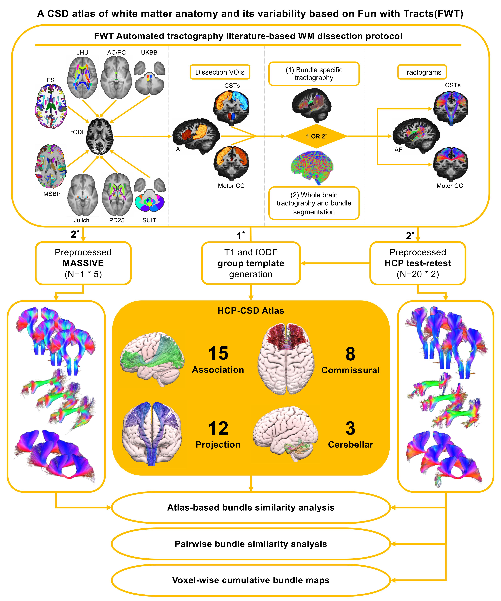
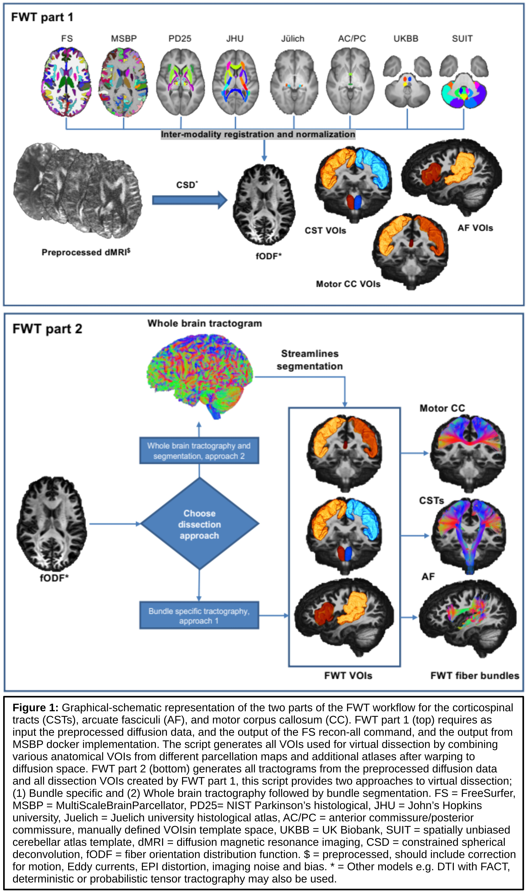

# KUL_FWT

"KULeuven - Fun With Tracts" - is a fully automated subject specific workflow for parcellation-based tractography using MRTrix3 for tractography, and ScilPy and Dipy tools for filtering, taking screenshots and generating bundle profiles.

Please refer to the BioRXiv preprint, "An atlas of white matter anatomy, its variability, and reproducibility based on Constrained Spherical Deconvolution of diffusion MRI", available here -> https://doi.org/10.1101/2021.10.13.464139

Additional material and information can also be accessed here -> https://osf.io/snq2d/

###*** This branch of the repository is up to date with the BioRxiv preprint, further development and additions can be found in the "dev" branch***###

## Introduction

FWT employs automated tractography using MRTrix3 (Tournier et al., 2019, p. 3) v3.0.2, which is constrained by a selection of grey matter and WM 3D VOIs/parcels used to create “inclusion” and “exclusion” areas, based on the neuroanatomical literature. These VOIs/parcels are obtained from FreeSurfer (Fischl, 2012) v6 (FS), the Multi-Scale Brain Parcellator (Tourbier et al., 2019) v1.1.1 (MSBP), and several apriori atlases (see supplementary materials for details), along with custom VOIs manually defined in template space (the anterior commissure midline, and posterior commissure VOIs), and other custom VOIs that are generated by label propagation, (e.g., subsegmentation of the periventricular white matter, temporal stem, insula, and superior temporal gyrus subcortical white matter). Streamlines filtering is done using ScilPy (Bore et al., 2021; “Scilpy documentation,” 2021) v.1.1.0 and DIPY (Garyfallidis et al., 2014) tools and v1.3.0 for all bundles except the optic radiations for which we used the fiber-to-Bundle Coherence tool in DIPY (Garyfallidis et al., 2014) v1.3.0. FWT can be used for individual bundle tractography or whole brain tractography followed by streamlines segmentation. 

## Description

The KUL_FWT repo contains 2 main workflows for individual datasets: 
    - The first is called KUL_FWT_make_VOIs.sh is responsible for the automated generation of all data preparation, and inclusion and exclusion VOIs from the FreeSurfer and MSBP parcellations, and the preprocessed diffusion data.
    - The second is called KUL_FWT_make_TCKs.sh is responsible for the automated generation of all tractograms, and streamline filtering, using the output from KUL_FWT_make_VOIs.sh

Equivalent workflows are also provided for group-averaged template data (T1 and FOD), as described in our manuscript. These are called KUL_FWT_make_VOIs_4Temp.sh and KUL_FWT_make_TCKs_4Temp.sh

Below is a schematic of the FWT workflow, followed by the user instructions for each part:

### Common required inputs for both parts are:
1) BIDS participant name (anonymised name of the subject without the "sub-" prefix) (input to -p)
2) BIDS participant session, if you have multiple sessions (session no. without the "ses-" prefix) (input to -s)
3) Full path and file name of scale 3 MSBP parcellation (input to -M)
4) full path and file name of aparc+aseg.mgz from FreeSurfer (input to -F)
5) Full path and name of FWT configuration file with list of tracks to segment from the whole brain tractogram (input to -c) 
6) Full path to directory with preprocessed diffusion data (specific to subject and session) (input to -d)

** Please note that while FWT will do some internal image processing and registration, it **requires** all input diffusion data to be fully preprocessed in advance, and full FreeSurfer recon-all and MSBP output directories **

## Configuration file explained:
1) See KUL_FWT directory for example configuration text file (KUL_FWT_tracks_list.txt)
2) This configuration file consists of 2 columns, separated by a comma on each row, the first lines is commented out.
3) Column 1 includes the bundle names, which need to match the bundle names in the script exactly.
4) Column 2 includes the required number of streamlines per bundle, and can be changed to your desired number of streamlines without problems.
5) You can exclude any of the bundles by adding a # at the start of the line, e.g. CST_LT,10000 -> # CST_LT,10000

## KUL_FWT_make_VOIs.sh generates all inclusion and exclusion VOIs for fully automated fiber tractography according to an input config file

    Usage:

    KUL_FWT_make_VOIs.sh -p pat001 -s 01  -F /path_to/FS_dir/aparc+aseg.mgz -M /path_to/MSBP_dir/sub-pat001_label-L2018_desc-scale3_atlas.nii.gz -d /path_to/dMRI_dir -c /path_to/KUL_FWT_tracks_list.txt -o /fullpath/output

    Examples:

    KUL_FWT_make_VOIs.sh -p pat001 -s 01 -F /path_to/FS_dir/aparc+aseg.mgz -M /path_to/MSBP_dir/sub-pat001_label-L2018_desc-scale3_atlas.nii.gz -d /path_to/dMRI_dir -c /path_to/KUL_FWT_tracks_list.txt -o /fullpath/output -n 6 

    Purpose:

    This workflow generates the VOIs needed for fiber tracking by KUL_FWT_make_TCKs.sh from input FS and MSBP for all bundles specified in the input config file for single subject data

    Required arguments:

    -p:  BIDS participant name (anonymised name of the subject without the "sub-" prefix)
    -s:  BIDS participant session (session no. without the "ses-" prefix)
    -M:  full path and file name of scale 3 MSBP parcellation
    -F:  full path and file name of aparc+aseg.mgz from FreeSurfer
    -c:  path to config file with list of tracks to segment from the whole brain tractogram
    -d:  path to directory with preprocessed diffusion data (specific to subject and run)
    

    Optional arguments:

    -n:  number of cpu for parallelisation (default is 6)
    -h:  prints help menu
	-o:  full path to output dir (if not set reverts to default output ./sub-*_ses-*_KUL_FWT_output)

## KUL_FWT_make_TCKs.sh part of the KUL_FWT package of fully automated workflows for fiber tracking

    Usage:

    KUL_FWT_make_TCKs.sh -p pat001 -s 01  -F /path_to/FS_dir/aparc+aseg.mgz -M /path_to/MSBP_dir/sub-pat001_label-L2018_desc-scale3_atlas.nii.gz -d /path_to/dMRI_dir -c /path_to/KUL_FWT_tracks_list.txt -o /fullpath/output -T 2 -f 2

    Examples:

    KUL_FWT_make_TCKs.sh -p pat001 -s 01 -F /path_to/FS_dir/aparc+aseg.mgz -M /path_to/MSBP_dir/sub-pat001_label-L2018_desc-scale3_atlas.nii.gz -d /path_to/dMRI_dir -c /path_to/KUL_FWT_tracks_list.txt -o /fullpath/output -n 6 -T 1 -f 1 -S -Q

    Purpose:

    This workflow creates all bundles specified in the input config file using the inclusion and exclusion VOIs created by KUL_FWT_make_VOIs.sh for single subject data

    Required arguments:

    -p:  BIDS participant name (anonymised name of the subject without the "sub-" prefix)
    -s:  BIDS participant session (session no. without the "ses-" prefix)
    -T:  Tracking and segmentation approach (1 = Bundle-specific tckgen, 2 = Whole brain tckgen & bundle segmentation)
    -M:  Full path and file name of scale 3 MSBP parcellation
    -F:  Full path and file name of aparc+aseg.mgz from FreeSurfer
    -c:  Path to config file with list of tracks to segment from the whole brain tractogram
    -d:  Path to directory with preprocessed diffusion data (specific to subject and run)

    Optional arguments:

    -a:  Specify algorithm for tckgen fiber tractography (tckgen -algorithm options are: iFOD2, iFOD1, SD_STREAM, Tensor_Det, Tensor_Prob)
    -f:  Specify filtering approach (0 = No filtering, 1 = conservative, 2 = liberal)
	-o:  Full path to output dir (if not set reverts to default output ./sub-*_ses-*_KUL_FWT_output)
    -Q:  If set quantitative and qualitative analyses will be done
    -S:  If set screenshots will taken of each bundle
    -n:  Number of cpu for parallelisation (default is 6)
    -h:  Prints help menu
