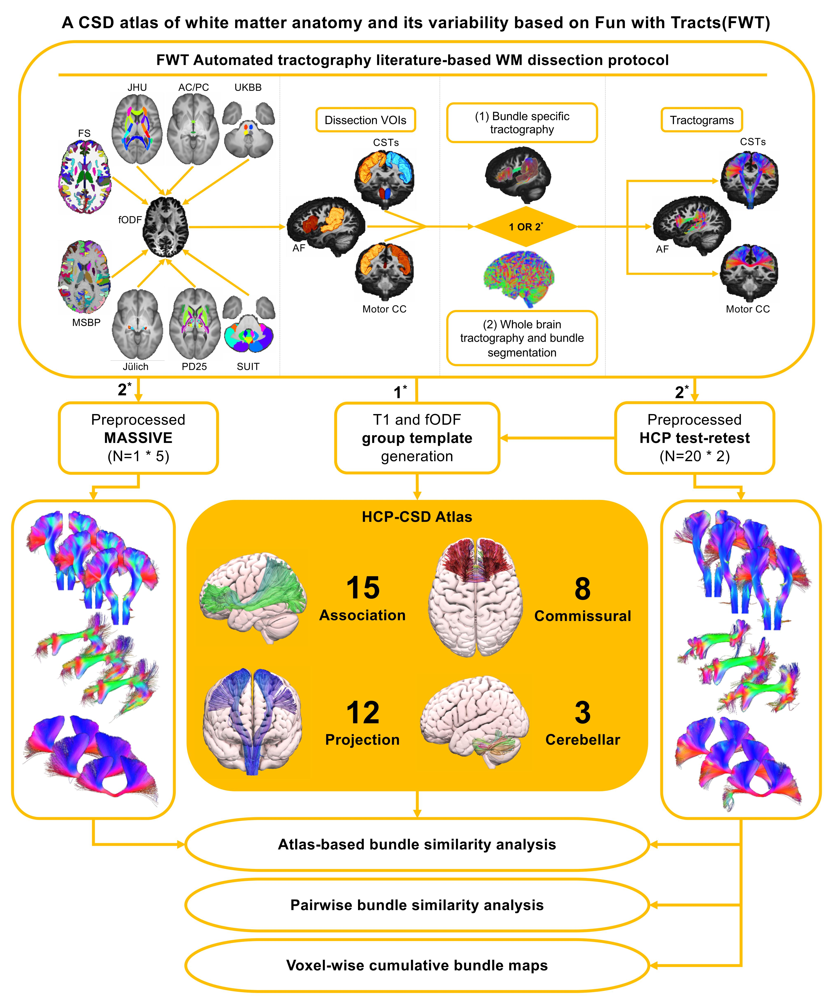
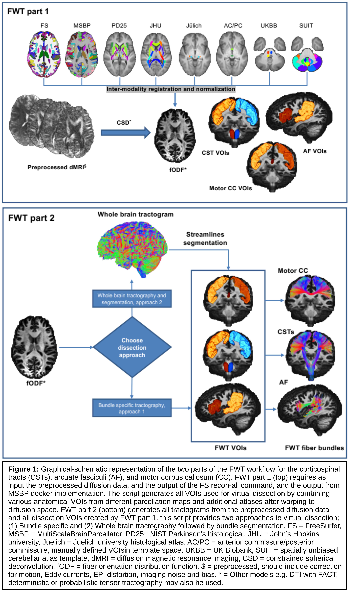

# KUL_FWT

**"KULeuven - Fun With Tracts"** is a fully automated, subject-specific workflow for parcellation-based tractography, using MRtrix3 for tractography and ScilPy/DIPY tools for filtering, taking screenshots, and generating bundle profiles.

Please refer to the bioRxiv preprint, *"An atlas of white matter anatomy, its variability, and reproducibility based on Constrained Spherical Deconvolution of diffusion MRI"*: <https://doi.org/10.1101/2021.10.13.464139>

Additional material and information can also be found here: <https://osf.io/snq2d/>

> **This is the KUL_FWT v2.0 branch.** The version matching the bioRxiv preprint is in the branch `Orig_https/doi.org/10.1101/2021.10.13.464139`. Further development continues in the `dev` branch.

---

## v2.0 Release Notes (2026-07-01)

- **Externalised bundle recipes** — all bundle VOI include/exclude definitions have been moved out of the hardcoded if/elif chain in `make_VOIs.sh` and `make_VOIs_4Temp.sh` into individual text files under `track_recipes/` (one file per bundle). The scripts now loop over recipe files, making it straightforward to add, modify, or disable bundles without editing the main script.
- **New bundles** — added `CPCT_LT` and `CPCT_RT` (Corticopontocerebellar Tract) with appropriate hemisphere auto-exclusions in `make_TCKs.sh` and `make_TCKs_4Temp.sh`; added `ThR_S1_LT` and `ThR_S1_RT` (thalamo-S1 radiation).
- **Bug fixes:**
  - Fixed a race condition in `make_VOIs.sh` where background custom-VOI creation jobs (`hypothal_vDC`, `Bs_Pons`, etc.) were not guaranteed to complete before the bundle loop read them; a `wait` call was added at the correct synchronisation point.
  - Fixed `count_checker` string comparison in `make_TCKs.sh` (`== 0` → `-eq 0`) to correctly handle leading whitespace from `cut`.
  - Fixed a spurious label `"14"` in `SLF_IIv_RT_incs1_Is`.
  - Added a fallback in `make_TCKs.sh` and `make_TCKs_4Temp.sh`: if recobundles crashes silently and `filt5` is never created, `filt4` is promoted to `filt5` so downstream steps are not blocked.
- **Tool versions tested with this release** — MRtrix3 v3.0.4, FreeSurfer v8.2.0, ScilPy v2.3.0, DIPY v1.3.0. ScilPy version is now logged at runtime in the TCKs log file.

---

## Introduction

FWT employs automated tractography using **MRtrix3** (Tournier et al., 2019, p. 3) v3.0.4, constrained by a selection of grey-matter and WM 3D VOIs/parcels used to create "inclusion" and "exclusion" areas, based on the neuroanatomical literature.

These VOIs/parcels are obtained from **FreeSurfer** (Fischl, 2012) v8.2.0 (FS) — its `aparc+aseg`, `wmparc`, lobar and fornix segmentations, plus the **Lausanne2018** scale-3 cortical parcellation generated from the same FreeSurfer subject by `KUL_FS_multiparc.sh` in KUL_NIS — and several a priori atlases (see supplementary materials for details), along with custom VOIs manually defined in template space (the anterior commissure midline and posterior commissure VOIs), and other custom VOIs generated by label propagation (e.g. subsegmentation of the periventricular white matter, temporal stem, insula, and superior temporal gyrus subcortical white matter).

Streamline filtering is done using **ScilPy** (Bore et al., 2021; "Scilpy documentation," 2021) v2.3.0 and **DIPY** (Garyfallidis et al., 2014) tools v1.3.0 for all bundles except the optic radiations, for which the Fiber-to-Bundle Coherence tool in DIPY v1.3.0 is used. FWT can be used for individual bundle tractography or whole-brain tractography followed by streamline segmentation.

---

## Description

The KUL_FWT repo contains 2 main workflows for individual datasets:

1. **`KUL_FWT_make_VOIs.sh`** — automated generation of all data preparation, and inclusion/exclusion VOIs, from the FreeSurfer parcellations (`aparc+aseg` plus `lausanne2018.scale3+aseg` in the same `mri/` directory) and the preprocessed diffusion data.
2. **`KUL_FWT_make_TCKs.sh`** — automated generation of all tractograms and streamline filtering, using the output from `KUL_FWT_make_VOIs.sh`.

Equivalent workflows are also provided for group-averaged template data (T1 and FOD), as described in our manuscript: **`KUL_FWT_make_VOIs_4Temp.sh`** and **`KUL_FWT_make_TCKs_4Temp.sh`**.



Below is a schematic of the FWT workflow, followed by the user instructions for each part:



### Common required inputs for both parts

| Flag | Meaning |
|---|---|
| `-p` | BIDS participant name (anonymised name of the subject without the `sub-` prefix) |
| `-s` | BIDS participant session, if you have multiple sessions (session no. without the `ses-` prefix) |
| `-F` | Full path and file name of `aparc+aseg.mgz` from FreeSurfer |
| `-c` | Full path and name of the FWT configuration file, listing tracks to segment from the whole-brain tractogram |
| `-d` | Full path to directory with preprocessed diffusion data (specific to subject and session) |

> **Note:** while FWT will do some internal image processing and registration, it **requires** all input diffusion data to be fully preprocessed in advance, and a full FreeSurfer `recon-all` output directory that also contains `lausanne2018.scale3+aseg.mgz` (produced by `KUL_FS_multiparc.sh` in KUL_NIS).
>
> **Note on MSBP:** earlier versions of FWT took the scale-3 parcellation from the Multi-Scale Brain Parcellator (Tourbier et al., 2019) via a `-M` flag. MSBP has since been dropped in favour of the FreeSurfer-derived Lausanne2018 parcellation, and neither script takes `-M` for that purpose any more — in `KUL_FWT_make_TCKs.sh`, `-M` now means something else entirely (the tracking-mask rind exclusion). VOI names in `track_recipes*/` still carry `_MSBP_` for historical reasons; their `atlas` column reads `Lausanne3`, which is what they actually resolve against.

---

## Prerequisites

`KUL_FWT_make_TCKs.sh` and `KUL_FWT_make_TCKs_4Temp.sh` call ScilPy tools (`scil_*`) directly and assume they are available on `PATH`. The scripts do **not** activate any conda environment internally. Before running either script, ensure your ScilPy environment is active, for example:

```bash
conda activate scilpy   # or whatever you named your environment
```

Any installation method is supported (conda, pip, container bind-mount) as long as `scil_tractogram_filter_by_roi` and related tools resolve on the command line. The ScilPy version is logged automatically at runtime in the KUL_FWT_TCKs log file. v2.3.0 is the version tested with this release.

---

## Configuration file explained

1. See the KUL_FWT directory for an example configuration text file (`KUL_FWT_tracks_list.txt`).
2. This configuration file consists of **2 columns**, separated by a comma on each row; the first line is commented out.
3. **Column 1** — the bundle names, which need to match the bundle names in the script exactly.
4. **Column 2** — the required number of streamlines per bundle; change to your desired number without problems.
5. You can exclude any bundle by adding a `#` at the start of its line, e.g. `CST_LT,10000` → `# CST_LT,10000`.

---

## `KUL_FWT_make_VOIs.sh`

Generates all inclusion and exclusion VOIs for fully automated fiber tractography according to an input config file.

### Usage

```bash
KUL_FWT_make_VOIs.sh -p pat001 -s 01 -F /path_to/FS_dir/aparc+aseg.mgz -d /path_to/dMRI_dir -c /path_to/KUL_FWT_tracks_list.txt -o /fullpath/output
```

### Example

```bash
KUL_FWT_make_VOIs.sh -p pat001 -s 01 -F /path_to/FS_dir/aparc+aseg.mgz -d /path_to/dMRI_dir -c /path_to/KUL_FWT_tracks_list.txt -o /fullpath/output -n 6
```

### Purpose

Generates the VOIs needed for fiber tracking by `KUL_FWT_make_TCKs.sh`, from the FreeSurfer parcellation (aparc+aseg plus lausanne2018.scale3+aseg in the same mri/ dir), for all bundles specified in the input config file, for single-subject data.

### Required arguments

| Flag | Meaning |
|---|---|
| `-p` | BIDS participant name (anonymised name of the subject without the `sub-` prefix) |
| `-s` | BIDS participant session (session no. without the `ses-` prefix) |
| `-F` | Full path and file name of `aparc+aseg.mgz` from FreeSurfer |
| `-c` | Path to config file with list of tracks to segment from the whole-brain tractogram |
| `-d` | Path to directory with preprocessed diffusion data (specific to subject and run) |

### Optional arguments

| Flag | Meaning |
|---|---|
| `-n` | Number of CPUs for parallelisation (default: 6) |
| `-o` | Full path to output dir (default: `./sub-*_ses-*_KUL_FWT_output`) |
| `-h` | Prints help menu |

---

## `KUL_FWT_make_TCKs.sh`

Part of the KUL_FWT package of fully automated workflows for fiber tracking.

### Usage

```bash
KUL_FWT_make_TCKs.sh -p pat001 -s 01 -F /path_to/FS_dir/aparc+aseg.mgz -d /path_to/dMRI_dir -c /path_to/KUL_FWT_tracks_list.txt -o /fullpath/output -T 2 -f 2
```

### Example

```bash
KUL_FWT_make_TCKs.sh -p pat001 -s 01 -F /path_to/FS_dir/aparc+aseg.mgz -d /path_to/dMRI_dir -c /path_to/KUL_FWT_tracks_list.txt -o /fullpath/output -n 6 -T 1 -f 1 -S -Q
```

### Purpose

Creates all bundles specified in the input config file, using the inclusion and exclusion VOIs created by `KUL_FWT_make_VOIs.sh`, for single-subject data.

### Required arguments

| Flag | Meaning |
|---|---|
| `-p` | BIDS participant name (anonymised name of the subject without the `sub-` prefix) |
| `-s` | BIDS participant session (session no. without the `ses-` prefix) |
| `-T` | Tracking and segmentation approach: `1` = bundle-specific tckgen, `2` = whole-brain tckgen & bundle segmentation, `3` = whole-brain tckgen with MRtrix3 FreeSurfer ACT, `4` = bundle-specific seeding from the grey-white matter interface, `5` = bundle-specific seeding from subcortical WM one voxel past the GM/WM interface, including against a tightened WM-ring + interface + cortex-rim band instead of the raw VOI |
| `-F` | Full path and file name of `aparc+aseg.mgz` from FreeSurfer |
| `-c` | Path to config file with list of tracks to segment from the whole-brain tractogram |
| `-d` | Path to directory with preprocessed diffusion data (specific to subject and run) |

### Optional arguments

| Flag | Meaning |
|---|---|
| `-a` | Algorithm for tckgen fiber tractography (`tckgen -algorithm` options: `iFOD2`, `iFOD1`, `SD_STREAM`, `Tensor_Det`, `Tensor_Prob`) |
| `-f` | Filtering approach — how hard outlier rejection cuts: `0` = none, `1` = standard (score floor 0.40, at most 10% of a bundle dropped), `2` = lenient (floor 0.30, at most 5%), `3` = legacy strict (floor 0.58, no ceiling — the pre-2026-09 behaviour that stripped the cortical fan off fanning bundles; only for reproducing older runs). Every level enforces a hard floor of 65% retention. Levels `1`/`2` were previously labelled *conservative*/*liberal*, with `1` in fact being the most aggressive of the three |
| `-o` | Full path to output dir (default: `./sub-*_ses-*_KUL_FWT_output`) |
| `-Q` | If set, quantitative and qualitative analyses will be done (along-tract tractometry, per-bundle connectivity, and the interactive per-bundle HTML report — see [Outputs](#outputs) below) |
| `-S` | If set, screenshots will be taken of each bundle (and assembled into one subject-level HTML contact sheet — see [Outputs](#outputs) below) |
| `-n` | Number of CPUs for parallelisation (default: 6) |
| `-h` | Prints help menu |

#### dMRI input overrides (for pipelines other than KUL_dwiprep)

| Flag | Meaning |
|---|---|
| `-W` | Full path to WM FOD file; must be in the same space as the FA given to `KUL_FWT_make_VOIs.sh` (which determines the output space of all VOIs) |
| `-G` | Full path to FA map co-registered with the FOD (`.nii.gz`) |
| `-B` | Full path to brain mask co-registered with the FOD (`.nii.gz`) |
| `-L` | Full path to LoRE-SD ODF (same space as the VOI masks); overrides `-W` when given |
| `-C` | Full path to LoRE-SD contrasts directory |

#### Experimental opt-ins

All default to off; without them behaviour is unchanged.

| Flag | Meaning |
|---|---|
| `-U` | Prefer an rfa-modulated LoRE-SD FOD over the plain LoRE-SD ODF when one is found |
| `-R` | Reordered filtering chain: ROI filter → anatomy-endpoint filter → smooth → N-run bootstrap RecoBundles + occurrence vote → loop-detect → outlier-reject → fin. Shape-validates against the model *before* the two filters whose thresholds are computed from the current population's own distribution |
| `-K` | Dilate cortical inclusion VOIs inward into WM by one pass before tckgen, to tolerate registration imprecision at the GM/CSF boundary without crossing a sulcus |
| `-O` | Use `-include_ordered` instead of `-include`: a streamline must traverse the recipe's inclusion VOIs *in order*. Meaningful for a real multi-stop chain (e.g. DRT), near-meaningless for a 2-VOI bundle. Also narrows seeding to the chain's first VOI and tracks unidirectionally, which `-include_ordered` requires |
| `-Z <mm>` | Explicit tckgen `-step` override, replacing its default (0.5 × voxel size for iFOD2) |
| `-Y` | Use `-seed_random_per_voxel` instead of `-seed_voxels`, with per-VOI seed counts weighted *inversely* to voxel count (~50000 attempts per seed VOI regardless of size). Fixed total budget, so a bundle may come back under `-select` |
| `-M <N>` | Exclude the outermost N-voxel rind from the tckgen tracking mask, for `-T 1/4/5` only. Erodes the whole CSF-stripped brain mask by N passes, then adds back corpus callosum, fornix, brainstem and the periventricular zone |
| `-X <val>` | Explicit tckgen `-cutoff` (FOD amplitude at which a streamline terminates; an FA threshold for the tensor/FACT algorithms). Applies to every tckgen in the run, bundle-specific and whole-brain. Without it the cutoff follows the reconstruction: MRtrix's own default for an ordinary CSD FOD, `0.05` for a LoRE-SD one, since the two are not on the same amplitude scale. Set it to pin one value across reconstructions — what you want when *comparing* them |

---

## Outputs

Per bundle, under `<output>/sub-*_TCKs_output/<BUNDLE>_output/`:

| File | Needs | What it is |
|---|---|---|
| `<BUNDLE>_fin_BT_<algo>.tck` | — | The final bundle, MRtrix format |
| `<BUNDLE>_fin_BT_<algo>.trk` | scilpy | The same bundle in TrackVis format, for **freeview**, which does not read `.tck` |
| `Screenshots/*.png` | `-S` | 3 orientations × 4 renderings (tract alone / over anatomy, 3D / glass brain) |
| `QQ/*_scores_*.txt` | `-Q` | Along-tract profiles, one row per segment, per metric |
| `QQ/*_connectivity_matrix.csv` | `-Q` | Endpoint parcel × parcel streamline counts |
| `QQ/sub-*_spider3d_<BUNDLE>.html` | `-Q` | **Interactive per-bundle report** (see below) |

And per subject, at the top of `sub-*_TCKs_output/`:

| File | Needs | What it is |
|---|---|---|
| `sub-*_bundle_metric_means.csv` | `-Q` | One bundle × metric summary table |
| `sub-*_FWT_report.html` | `-S` | **Contact sheet** of every bundle's screenshots |

**The per-bundle HTML** is self-contained (inline SVG and JS, no sibling files or network access) so it can be copied anywhere. It shows a drag-to-rotate 3D tower of the metric fingerprint beside the actual bundle geometry, an along-tract profile for every metric, and an endpoint-connectivity section naming the parcels the bundle joins — a ranked pair table plus a heatmap restricted to the parcels actually touched. Every axis is normalised across *this subject's own* bundles, since a single clinical subject has no population reference.

**The contact sheet** puts every bundle on one page: three orientations each, with the rendering switchable for all bundles at once, a filter box, each bundle's strongest endpoint pair in its caption, and a link to that bundle's detail page. Screenshots are downscaled and JPEG-encoded on the way in (the raw PNGs total ~32 MB per subject, which no browser opens comfortably as base64). The links are bare filenames, so if you copy these out, keep the contact sheet and the per-bundle pages in the same directory.

**`.trk` reference space.** The conversion uses the subject's FA image, not the FreeSurfer parcellation passed to `-F`. `KUL_FWT_make_VOIs.sh` registers FreeSurfer to FA itself and warps every label into FA space, so tracking — and therefore these streamlines — happen in FA space. Those two frames coincide only when the dMRI was already aligned to the T1w upstream; if it was not (a separate session, say), an FS-space reference would produce a `.trk` that renders offset in freeview. `.tck` carries no reference at all, which is why this distinction only matters for the `.trk`.
